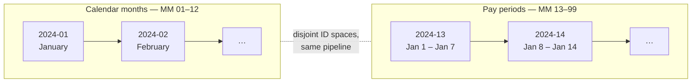
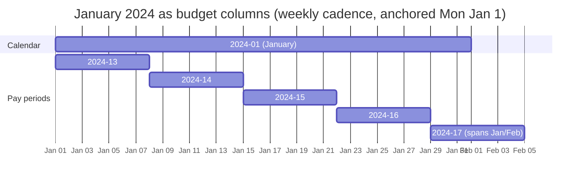
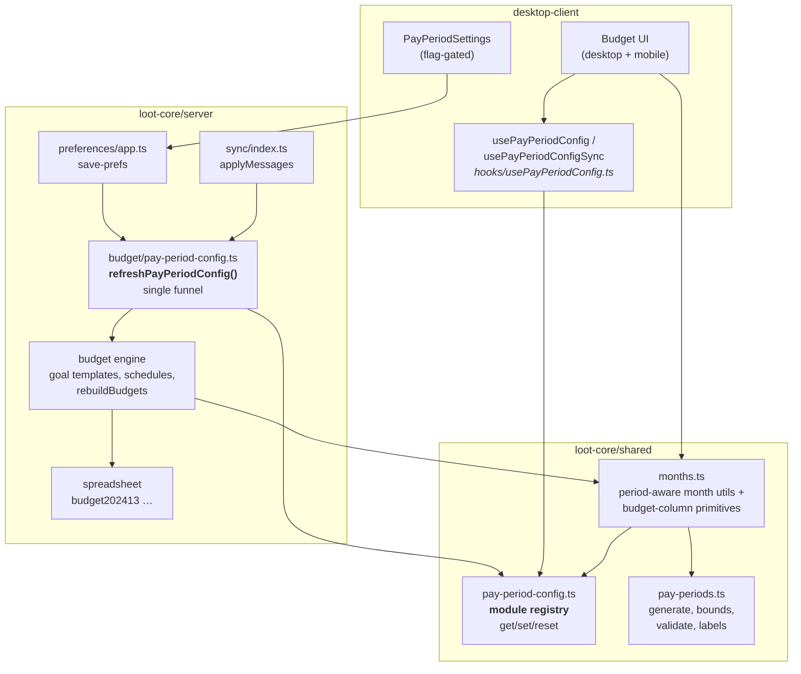
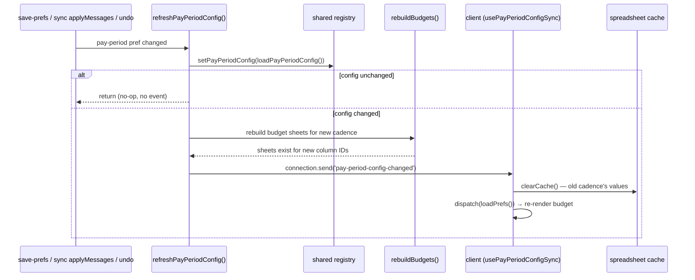
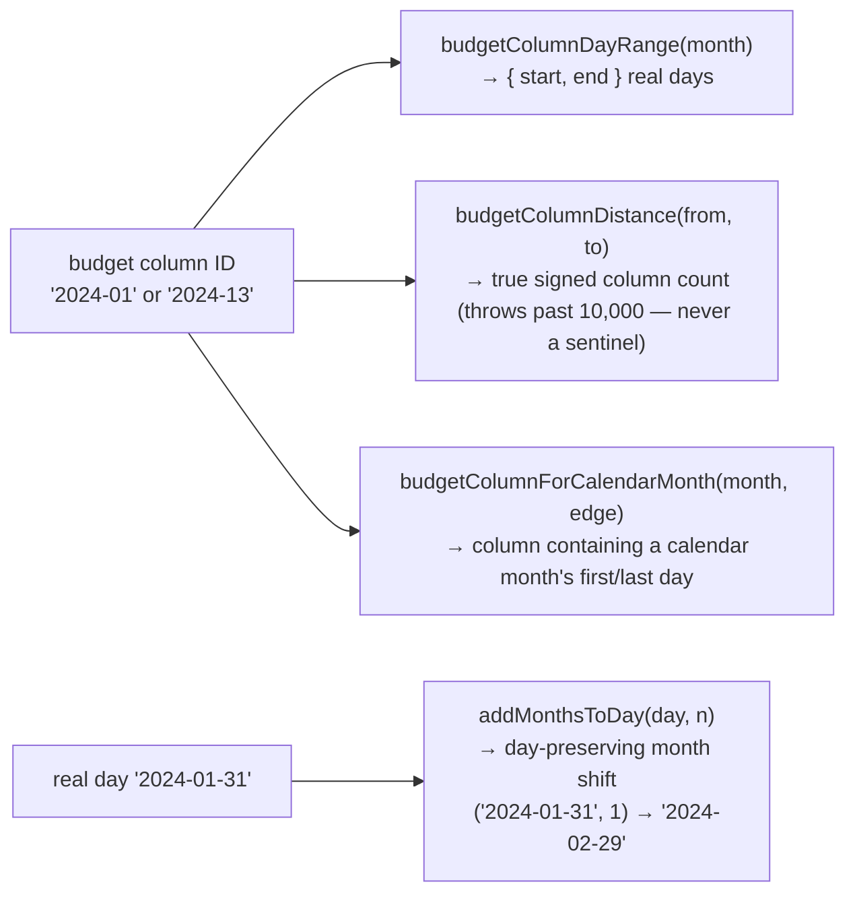
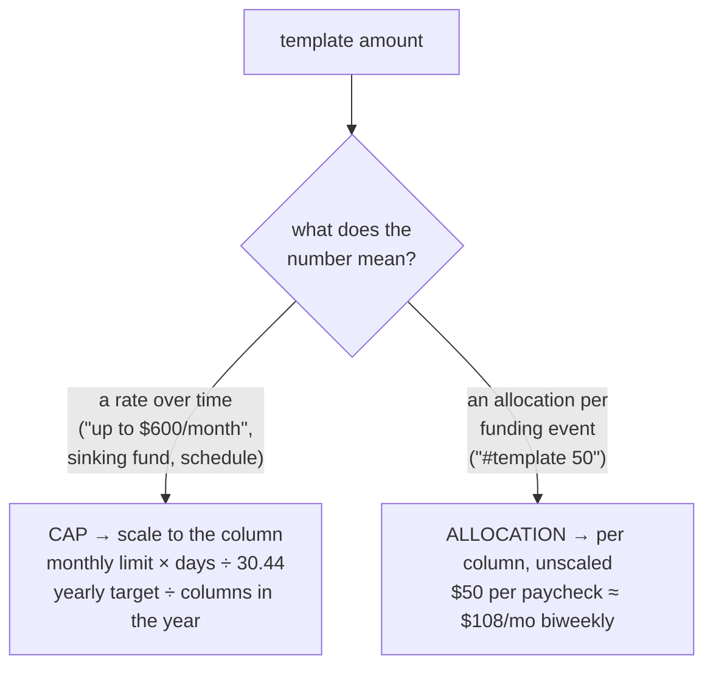

# Pay Periods — Architecture Brief

Pay-period budgeting lets a budget's columns follow the user's paychecks (weekly, biweekly,
or monthly-on-a-date) instead of calendar months. The guiding requirement was parity:
**if it can be done by a calendar month, a pay period should be able to do it** — budgeting,
goal templates, schedules, category transfers, notes, mobile, undo, and multi-device sync.

This brief records the load-bearing decisions and why they were made.

---

## 1. The core decision: pay periods are pseudo-months

Everything in Actual flows through the month ID — a `YYYY-MM` string that becomes an integer
key (`202601`), a sheet name (`budget202601`), a query bound, and a CRDT-synced row key.
Rather than introduce a parallel "period" concept (new tables, new sheet namespace, new sync
shape), a pay period **is** a month ID whose `MM` segment is `13–99`:



`2024-13` means _the first period starting in 2024_ under the active configuration; its real
date bounds are resolved on demand. Every downstream layer is reused unchanged:

| Layer       | Calendar       | Pay period     |
| ----------- | -------------- | -------------- |
| Month ID    | `2024-01`      | `2024-13`      |
| Integer key | `202401`       | `202413`       |
| Sheet name  | `budget202401` | `budget202413` |
| DB schema   | unchanged      | unchanged      |
| CRDT sync   | unchanged      | unchanged      |

Because `01–12` and `13–99` never collide, a budget file can hold both kinds of rows at once
— which is exactly what happens when a user switches cadence: the old rows stay (and sync),
they just stop being displayed. Switching back reinterprets nothing.

The visual anchor for how columns relate to real time under a weekly cadence:



A calendar month is covered by ~4.35 weekly columns, and a column can straddle two calendar
months. Every money bug found during hardening traced back to code assuming those two facts
away — see §4.

## 2. System overview



The dependency rule: **`months.ts` is the only API most code talks to.** It consults the
registry internally, so a call site never knows (or cares) whether `nextMonth('2024-13')`
walks a period chain or a calendar. That is what made parity tractable — the ~hundreds of
existing `monthUtils` call sites did not change.

## 3. Configuration: one registry, one funnel

### Why a module-scoped registry instead of threading config through calls

The failed prior attempt (`opsx_pp_13_99`) tried passing period context through call chains
and died by a thousand signatures. The config is budget-file-scoped, changes rarely, and is
needed by leaf utilities — the textbook case for module state with a **deliberately explicit
lifecycle** instead of parameter plumbing:

- **Server**: set at budget-file open (`budgetfiles/app.ts:638`), cleared at close (`:265`).
- **Client**: `usePayPeriodConfigSync` (mounted once, in `FinancesApp`) writes the registry
  **during render** — idempotent, keyed by `payPeriodConfigKey` — so components rendering in
  the same pass already resolve period IDs against the fresh config, before any effect runs.
- **Tests**: `setPayPeriodConfig`/`resetPayPeriodConfigForTesting` in `beforeEach`/`afterEach`.

The config itself is derived, never stored as its own object: four synced preferences
(`flags.payPeriodsEnabled`, `showPayPeriods`, `payPeriodFrequency`, `payPeriodStartDate`)
are validated into a `PayPeriodConfig | null`. Both sides derive it through one function each
(`loadPayPeriodConfig` on the server, `usePayPeriodConfig` on the client), so there is no
second copy to drift.

### The change funnel: rebuild before announce

Every path a config change can arrive by — local save, CRDT sync from another device or tab,
undo/redo — converges on `refreshPayPeriodConfig()`:



Two orderings here are correctness, not style:

1. **Rebuild before announce.** The client reacts to the event by re-binding the budget
   table. If the event fired before `rebuildBudgets()` finished, the client would read
   sheets that don't exist yet — and a missing sheet cell does not throw in Actual's
   spreadsheet, it materializes as `0` (see §4). The bug would be silent wrong numbers,
   not a crash.
2. **Cache clear before prefs reload** on the client. Sheet names collide across cadences
   only in the sense that cached cell values belong to the previous cadence; they must be
   dropped before the new render reads through the cache.

A dedicated event exists because synced preferences ride the `preferences` CRDT dataset,
which the client's generic sync-event prefs reload does not watch — a change initiated by
_another_ device would otherwise never reach this client's redux at all.

## 4. The silent-failure class, and the budget-column abstraction

The single recurring hazard of the pseudo-month encoding is that a period ID is a
**well-formed but meaningless date-ish string**. Three properties conspire to make misuse
silent instead of loud:

- `'2024-16' > '2024-12-31'` — a period ID string-sorts after every day and month of its year.
- `parse('2024-16' + '-01')` — date-fns happily parses concatenated nonsense into a real
  (wrong) date rather than throwing.
- Reading a sheet cell that was never created returns `0`, not an error.

So the failure mode is never a stack trace; it is a plausible-looking wrong balance. The
answer was to stop treating months as strings you do arithmetic on, and route all
column-time math through four primitives in `shared/months.ts`:



Each replaced a specific class of bug found in the goal-template engine: cadence anchors
snapping to the 1st (double-funding), a `-1` distance sentinel reaching a division
(`Infinity` written into a budget cell), month-string concatenation for date bounds.

**Enforcement, not convention:** a custom lint rule, `actual/no-month-date-concat`
(`packages/eslint-plugin-actual`), flags `month + '-01'`-style concatenation and template
literals ending in a date suffix, scoped to the budget-column code paths
(`server/budget`, `shared`, budget components/hooks). It is deliberately **not** repo-wide:
the reports layer is calendar-by-design (§6) and blanket enforcement would only breed
suppression comments. The two modules that legitimately assemble dates
(`shared/months.ts`, `shared/pay-periods.ts`) and test files are exempted.

## 5. Goal templates: a cap is not an allocation

Templates were written assuming a column ≈ a month. Under a weekly cadence that assumption
inflates or starves budgets by ~4.3×. The fix required a semantic decision, settled
deliberately (with the user) rather than uniformly:



- **Time-rates are pro-rated.** A monthly `up to $600` limit becomes
  `600 × daysInColumn ÷ (365.25/12)` (≈ $276 for a two-week column). Sinking funds and
  schedules divide their target by the number of _columns_ until due
  (`budgetColumnDistance` / `columnsInCalendarMonths`), not by 12.
- **Plain fixed amounts are per-column, unscaled.** `#template 50` means "$50 each time I
  budget" — per paycheck. This is the one deliberate asymmetry, and the user docs
  (`packages/docs/docs/budgeting/pay-periods.md`) state it explicitly, because a user who
  assumes either rule uniformly will be surprised by the other.

Scaling applies only when `isPayPeriod(month)` — calendar-mode arithmetic is untouched,
verified by parallel calendar-mode tests pinning the historical values.

## 6. Reports: an explicit boundary, not a degraded one

Budget-backed reports (Budgeted balance type, Sankey budget mode, Spending budget
comparison, Budget Analysis) aggregate by calendar month and read `budget2024MM` sheets that
don't exist in period mode — which, per §4, would render as confident zeros. The decision
(user-settled): **do not fake it**. While a pay-period config is active these surfaces render
an explicit "unavailable" state, mode buttons are disabled with a tooltip, and saved
dashboard cards are gated in `GetCardData`. Transaction-backed reports (cash flow, net
worth, spending by category) are date-range based and work unchanged.

This keeps the calendar-by-design layer honest instead of silently wrong, and leaves a clean
seam for the deferred follow-up (a real "pay period" report interval — the `envelope-budget-month`
query already accepts period IDs; the blocker is the `ReportOptions` interval-label contract).

## 7. Client concurrency: stale async bounds

Budget bounds (`get-budget-bounds`) are fetched async while the config can change underneath
— the historical crash source for live cadence switching (mixing period and calendar IDs in
one month range). The pattern, used by both desktop `budget/index.tsx` and mobile
`BudgetPage.tsx`:

```mermaid
sequenceDiagram
  participant U as user
  participant B as budget page
  participant S as server

  U->>B: cadence = weekly
  B->>S: get-budget-bounds (tagged key=weekly|2024-01-01)
  U->>B: cadence = calendar (before response)
  B->>S: get-budget-bounds (tagged key=calendar)
  S-->>B: weekly bounds arrive
  Note over B: applyBoundsIfCurrent: weekly ≠ live registry key → DROPPED
  S-->>B: calendar bounds arrive
  Note over B: key matches → applied
  Note over B: render gate: bounds.configKey ≠ current key → don't<br/>render a mixed table; .catch → single-column fallback,<br/>never a permanent spinner
```

Three layers: tag the request with the `payPeriodConfigKey` at issue time, drop responses
whose tag no longer matches the live registry, and gate rendering on the tag so a stale
bounds object can never produce a mixed period/calendar month range. Failures degrade to a
single-column view instead of hanging.

## 8. Testing posture

- **Real infrastructure over mocks**: goal-template and config-funnel tests run against a
  real SQLite db and real spreadsheet (`emptyDatabase` + `loadSpreadsheet`), because the
  hazard class (§4) lives precisely in the seams mocks paper over.
- **Negative controls**: every money fix's test was verified by reverting the fix and
  observing the exact buggy value (e.g. 20000 vs 10000 double-funding, `Infinity` from the
  sentinel division, 60000 vs 13799 for an unscaled cap). A test that can't fail is
  documentation, not coverage — the few that are genuinely characterization are labeled so.
- **E2E parity suites** (`pay-periods.test.ts`, `pay-periods.mobile.test.ts`) walk the same
  flows the calendar-budget suites do, plus cadence switching and settings validation.
- **Calendar-mode pinning**: every period-aware change ships with a calendar-mode test
  pinning the pre-existing value, so parity regressions in the default mode are loud.

## 9. Known deferrals

Recorded so they read as decisions, not omissions: period-aware budget report intervals
(§6), a branded `BudgetColumnId` type to make §4 a compile-time guarantee, a pay-period
month picker for budget automations, and three low-risk robustness one-liners around sheet
loading and kvcache pruning.
